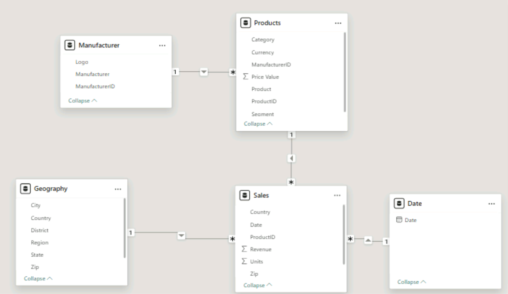

# 📊 Power BI Dashboard – Competitor Sales Analysis

🎯 Project Objectives

Analyze market sales data to understand competitive dynamics, identify key growth drivers, and highlight strategic business insights through an interactive Power BI dashboard.

This project simulates a real-world business case based on a DataCamp project and focuses on transforming raw data into actionable decision-making insights.

---
📦 Dataset

- Source: DataCamp.co (real-world inspired dataset)
- Files: sales.csv, bi_dimensions.xlsx
- Volume: + 700 000 rows
- Data types: sales transactions, products, manufacturers, geography, time

---
🛠️ Tools

- Power BI (DAX, Power Query(ETL), Data modeling)

---
🔍 Methodology

1. Data Integration in Power BI (.csv,.xlsx)
2. Data Cleaning & Transformation
3. Exploratory data analysis (EDA)
4. Data Modeling
5. KPI definition and calculation
6. Visualization, Dashboard creation

---
🧹 Data Preparation Highlights

- Handling missing values and inconsistent formats
- Column splitting, transposition, and table reshaping
- Table appending to consolidate international and domestic sales
- Creation of composite keys for accurate relationships
- Calendar table creation using DAX (CALENDAR())

⸻
📐 Data Model

The model is structured around a Sales fact table connected to:
  - Product hierarchy (Category → Segment → Product)
	- Manufacturer
	-	Geography
	- Date dimension

This structure enables flexible analysis across time, geography, and competitive dimensions.
🖼️ 
⸻

## 🖼️ Dashboard Preview

---

## ✅ Key Outcomes
- Identification of the TOP competitors generating the most revenue
- Best performing segments and products
- Growth over time
- Sales compared to previous year
