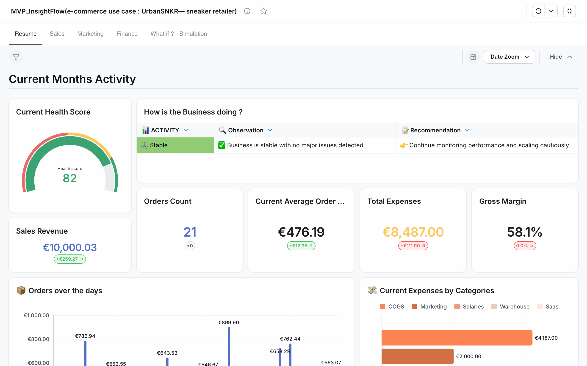
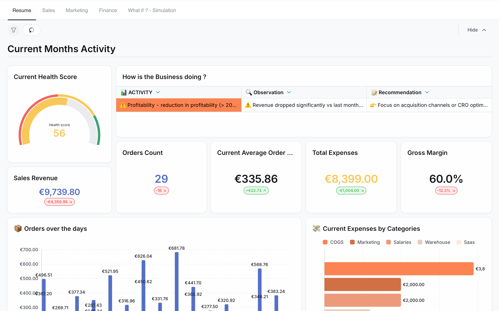
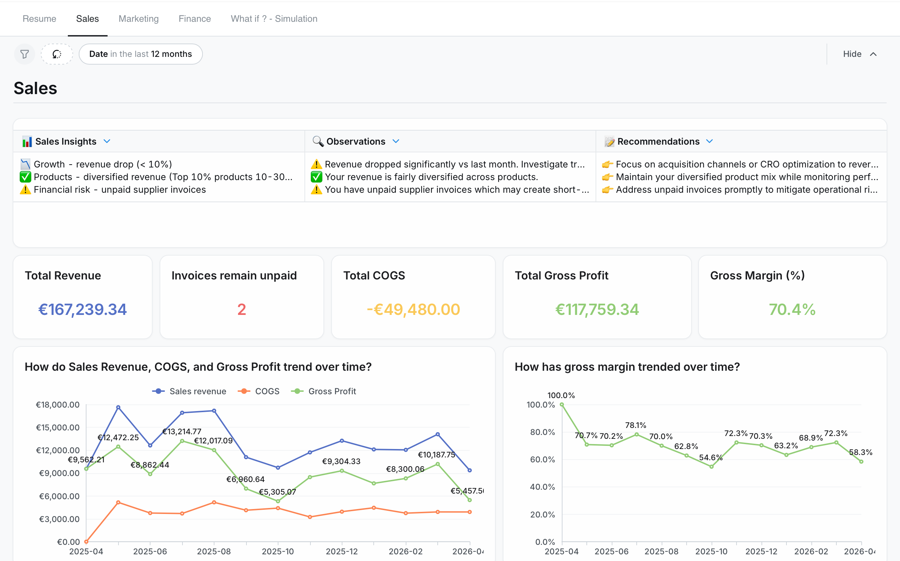
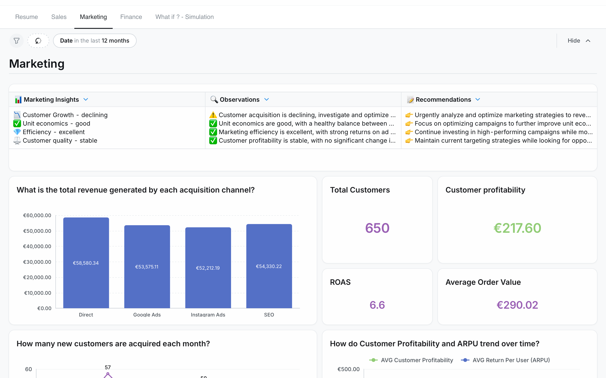
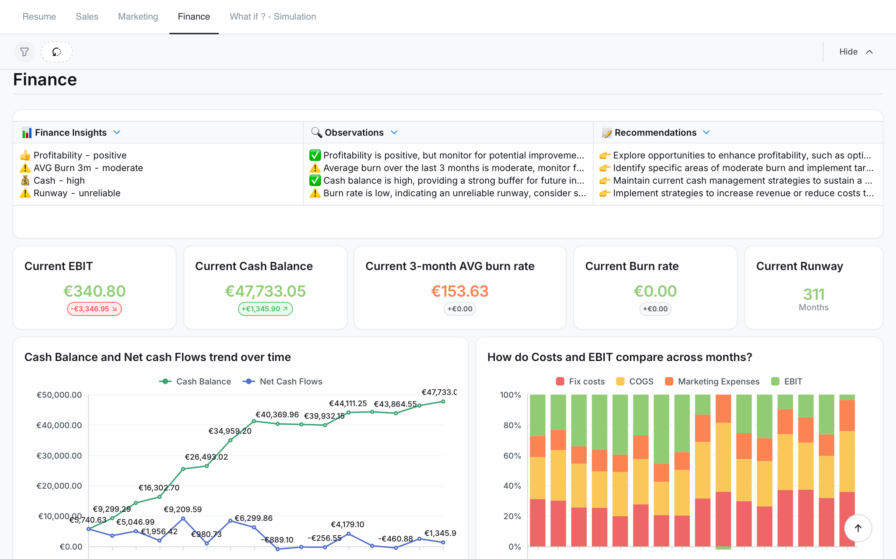
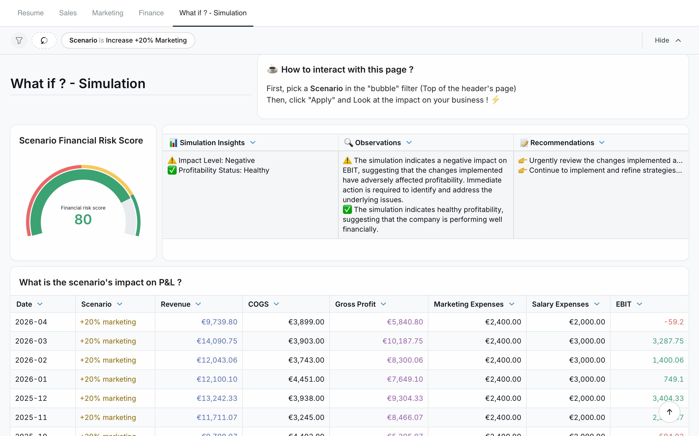

# 🚀 InsightFlow — Business Performance & Financial Analytics MVP



**InsightFlow** is a data-driven MVP designed to help businesses monitor, understand, and optimize their **financial and commercial performance**.

Originally built for an e-commerce use case (UrbanSNKR — sneaker retailer), this solution goes beyond traditional dashboards by combining:

* 📊 Business analytics
* 💰 Financial monitoring
* 🔮 Scenario simulation
* 🧠 Automated insights & recommendations


### How to Access it :
👉 https://app.lightdash.cloud/projects/31db9122-8a88-43ed-b8fe-07c89fbc892a/dashboards


Log in with :
> mail : mvp.insightflow@gmail.com

> pwd : Urbansnkr!


Feel free to give some [📝 Feedback](https://form.jotform.com/260982215327054)

---

## 🎯 Problem Statement

Most businesses — especially e-commerce companies — face a major challenge:

> They can track revenue, but struggle to understand **profitability, cash flow, and real performance drivers**.

Common issues:

* Data scattered across tools (Shopify, Stripe, Ads, Accounting)
* No unified view of **profit, cash, and growth**
* Decisions based on revenue instead of **actual profitability**
* Limited ability to **simulate business scenarios**

---

## 💡 Solution

InsightFlow provides a **centralized decision-making tool** that transforms raw data into actionable insights.

It enables users to:

* Track financial and commercial KPIs in one place
* Understand real profitability (not just revenue)
* Monitor cash flow and business health
* Identify risks and opportunities
* Simulate strategic decisions (e.g. increase marketing spend)

---

## 🧱 Data Stack & Architecture

This MVP is built with a **modern, scalable data stack**:

* **Warehouse**: Google BigQuery
* **Transformation & Semantic Layer**: dbt
* **BI / Visualization**: Lightdash
* **Versioning & CI/CD**: Git

Architecture overview:

```
Data Sources (E-commerce, Payments, Marketing, Finance)
        ↓
BigQuery (central data warehouse)
        ↓
dbt (data modeling & metrics layer)
        ↓
Lightdash (dashboards & insights)
        ↓
End User (decision-making)
```

This architecture ensures:

* scalability
* reproducibility
* modularity
* easy extension to other business models

---

## 📊 Product Overview

InsightFlow is structured into 5 main modules:

### 1. Resume

* Monthly performance snapshot
* Health score
* Key KPIs comparison vs previous period
* Automated insights & recommendations


### 2. Sales

* Revenue trends
* Product performance
* Gross profit & margin analysis
* Identification of top and underperforming products


### 3. Marketing

* Customer acquisition metrics (CAC, CLV, ROAS)
* Channel performance
* Customer profitability
* Growth trends


### 4. Finance

* Profit & Loss overview
* Cash flow monitoring
* Burn rate & runway
* Cost structure analysis


### 5. What-if Simulation

* Scenario-based analysis (e.g. +20% marketing spend)
* Impact on revenue, profit, and EBIT
* Decision support for strategic planning


---

## 🧠 Key Differentiator

Unlike traditional BI dashboards, InsightFlow integrates:

👉 **Automated observations & recommendations**

Each dashboard includes:

* contextual insights
* anomaly detection
* business-oriented recommendations

This transforms the tool from:

```
Dashboard → Decision assistant
```

---

## 🌍 Adaptability to Other Businesses

Although built on an e-commerce dataset, InsightFlow is **industry-agnostic**.

It can be adapted to:

* SaaS businesses (MRR, churn, CAC)
* Marketplaces
* Retail (offline & omnichannel)
* Service companies

The core concept remains:

> unify data → model metrics → drive decisions

---

## 💎 Value Proposition

InsightFlow helps businesses:

* Move from **revenue tracking → profitability understanding**
* Gain visibility on **cash and financial health**
* Make **data-driven strategic decisions**
* Reduce reliance on spreadsheets
* Detect issues before they impact performance

---

## ⚠️ Current Limitations

As an MVP, some limitations remain:

* No real-time data ingestion
* Limited automation on external data sources
* Manual or simulated datasets
* No user authentication or multi-tenant support

---

## 🚧 Future Improvements

Several enhancements are planned:

### 1. Invoicing & Accounting Integration

* Invoice ingestion (API / CSV / tools)
* Real-time tracking of unpaid invoices
* Cash flow forecasting improvement

### 2. Automated Alerts

* Margin drop detection
* CAC increase alerts
* Cash risk notifications

### 3. Advanced Financial Modeling

* Working capital analysis
* Payment delays (customers & suppliers)
* Forecasting models

### 4. Customer Analytics

* Cohort analysis
* Retention & repeat purchase
* Customer segmentation

### 5. Productization

* API-based data ingestion
* Multi-client support
* SaaS deployment

---

## 🧪 Project Purpose

This project was built to:

* explore modern data stack architecture
* design a real-world business analytics product
* demonstrate end-to-end data product thinking
* validate the relevance of financial + operational dashboards

---

## 📬 Feedback & Contributions

Feedback is welcome!
Feel free to open an issue or reach out to discuss improvements or use cases.

Share your experience and help us improve our product
[📝 Feedback](https://form.jotform.com/260982215327054)

---

## 👤 Author

Built by Matthieu Colliaux

[🔗 LinkedIn](https://www.linkedin.com/in/matthieu-colliaux/)

---

⭐ If you find this project interesting, feel free to star the repository!

Thank you for visiting 🙂
