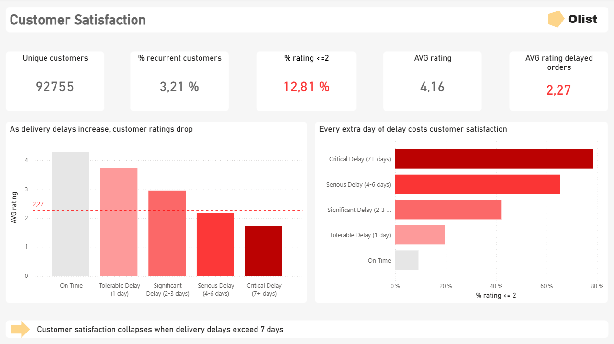

# 📊 Delivery Delays & Customer Satisfaction — Olist Case Study

## Overview
This project analyzes the impact of **delivery delays on customer satisfaction and business performance** for Olist, a Brazilian e-commerce marketplace.

The objective is to go beyond descriptive dashboards and provide **actionable, decision-oriented insights**, focusing on identifying **critical delivery delays** and quantifying their **customer and revenue impact**.

Project presentation available here : [📊](presentation/olist_customersatisfaction.pdf)

---

## 🎯 Business Questions
- Is **customer satisfaction** linked to delivery delays and logistical promises ?
- Are **delivery delays** significantly lower customers ratings ?
- Are delivery risks evenly distributed across **sellers** and **regions** ?
- What **business value** could be unlocked by fixing the most critical delays?

---

## 📦 Dataset
- **Source**: Olist Brazilian E-commerce Dataset (Kaggle)
- **Data types**: orders transactions
- **Scope**: ~96K delivered orders, ~93K unique customers

---

## 🗂️ Data Modeling & Preparation
- SQL-based data cleaning and transformation
- Feature engineering:
  - `is_delayed` flag
  - `delay_days`
  - delay severity levels (On time → Critical 7+ days) 
- OLAP **star schema**:
  - `fact_deliveries` (order-level grain, ONE ROW : one delivery->one seller->one customer->one review)
  - dimensions: customers, sellers, time
- Correct customer modeling using `customer_unique_id` (true business key)
- `review_score` Assign the most recent review score to the order (sometimes the review get updated couple times by the customer)
- `seller_id` Assign each order to the seller with the highest revenue within the order
  
---

## 📈 Key Insights

### 1️⃣ Customer Satisfaction [📊](screenshots/customersatisfaction.png)
- Average rating (all orders): **4.16**
- Average rating on delayed orders: **2.27**
- **12.81%** of reviews ≤ 2

➡️ **Customer satisfaction collapses when delivery delays exceed 7 days.**  
Beyond this threshold, negative reviews become dominant.

---

### 2️⃣ Logistics Performance [📊](screenshots/logistic.png)
- **6.66%** of delivered orders are delayed
- **Median delay: 7 days**
- **Average delay: 10.52 days**
- **50% of delays escalate into critical delays (7+ days)**

➡️ Delays are rare but **structurally severe**, driven by a long-tail of extreme cases.

---

### 3️⃣ Business Impact [📊](screenshots/business.png)
- Total revenue: **15.29M**
- Revenue from delayed orders: **1.11M**
- Revenue from critical delays (7+ days): **590K**
- **3,252** orders in critical delay

➡️ Delivery risk is **highly concentrated**:
- A small number of sellers drive most critical delays
- A few regions (e.g. RJ, SP) concentrate high-cost delivery failures

---

## 🔮 What-If Scenario — Fixing 7+ Day Delays
Based on current distributions:

- ~50% reduction in negative ratings
- +0.2 to +0.3 increase in overall average rating
- ~590K revenue removed from high-risk exposure
- High customer impact for limited operational effort

  ---

## ✅ Business Recommendations
1. **Introduce a 7-day Critical Delay SLA**
   - Automatic escalation
   - Proactive customer communication
   - Priority logistics handling

2. **Actively manage high-risk sellers**
   - Seller risk score based on critical delays, duration, and review impact
   - Targeted support or penalties
   - Focus on prevention rather than blanket sanctions

3. **Optimize high-risk regions**
   - Adjust delivery promises
   - Improve carrier allocation
   - Consider regional logistics hubs

---

## 🛠️ Tools & Skills
- **SQL**: data cleaning, window functions, feature engineering
- **Data Modeling**: star schema, OLAP best practices
- **Power BI**: DAX, calculated tables, advanced visuals
- **Analytics**: business-driven KPIs, what-if reasoning
- **Storytelling**: insight-to-decision communication

---

## 📌 Why This Project Matters
This case study demonstrates the ability to:
- Go beyond dashboards
- Prioritize problems based on **business impact**
- Translate data into **clear, actionable decisions**

Project presentation available here : [📊](presentation/olist_customersatisfaction.pdf)
