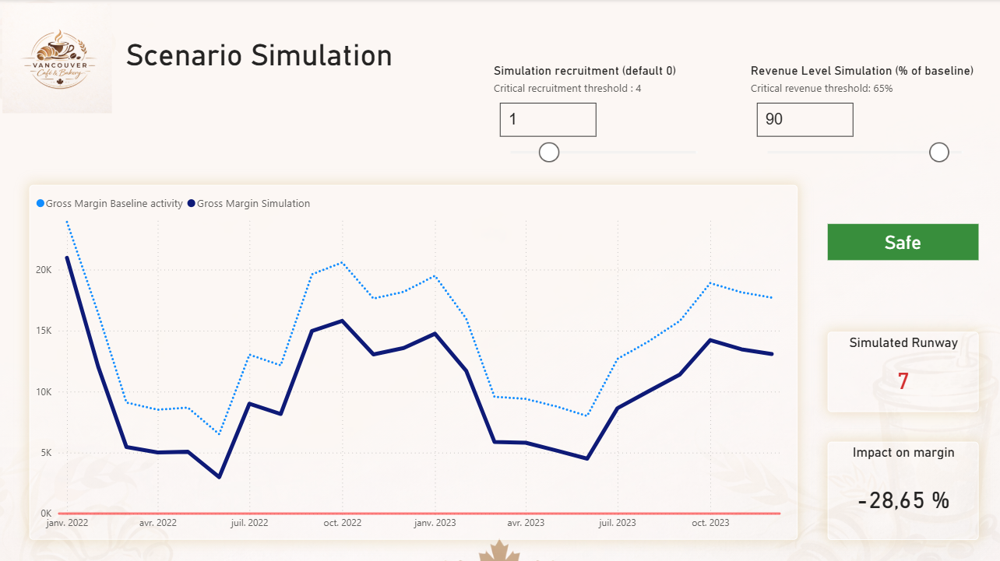

# ☕ Financial Performance & Risk Simulation
## Case Study – SME Retail (Café/Bakery, Vancouver)

## Overview

This project demonstrates how financial data can be transformed into a decision-support tool for small business owners.

Using real-world transactional data (2022–2023), I designed an **end-to-end financial analytics pipeline** :

- Data audit & validation (Python)
- OLAP financial modeling (SQL)
- Cloud warehousing (Google BigQuery)
- Executive dashboard & scenario simulation (Power BI)

The result:
**A dynamic financial cockpit enabling a business owner to**:

- Monitor profitability & cash flow
- Understand cost structure
- Analyze seasonality
- Stress-test hiring and revenue shocks

Project presentation available here : [📊](presentation/sbfd_cafeVancouver.pdf)

Dashboard here : [.PBIX](PowerBI/sbfd.pbix)

---

## 🎯 Business Problem
Small retail businesses often :
- Operate without structured financial monitoring
- Struggle with seasonal volatility
- Lack visibility on cost structure 
- Make hiring decisions without financial simulation

---

## 📦 Dataset
- **Source**: Small Business Financial Dataset (2022–2023) (Kaggle)
- **Data types**: bank accounts & credit card transactions

---

## 🏗 End-to-End Data Architecture
Python → SQL → BigQuery → Power BI

This project was intentionally designed as a complete analytics pipeline to demonstrate production-ready thinking.

---

## 🔎 Step 1 – Data Audit & Validation (Python)
### Tools
- Python
- Pandas

### Controls Performed
- Compliance / Missing values
- Duplicate detection / Unicity
- Business / Validity checks
- Outliers detection

### Result
A clean, validated financial dataset ready for analytical modeling.

Audit script here : [script](sources/python/audit_data_quality.py)

---

## 🧱 Step 2 – Financial OLAP Modeling (SQL)
Raw transactional tables were transformed into a **star schema**.

**Fact Table**
fact_transactions

**Grain definition**:
One row → One transaction 

Includes:
- Bank transactions
- Credit card transactions
- Financial classification (Revenue / Fixed Cost / Variable Cost / Neutral)

**Dimensions**:
- dim_date
- dim_category
- dim_employee

**Key Modeling Decisions**:

- Clear separation between operational and financial categories
- Isolation of internal transfers for payrolls (excluded from margin calculations)
- Financial structure optimized for KPI computation

SQL scripts here : [scripts](sources/SQL)

Here is the link to the Star Schema :
[Star Shema](screenshots/olapModel.png)

---

## ☁ Step 3 – Cloud Data Warehouse (Google BigQuery)

Why BigQuery?

- Scalable architecture
- SQL-native environment
- Cloud-ready analytics

Tables were loaded and structured for aggregation performance and analytical consistency.

DataBase Architecture here : 
[📦](screenshots/database_bigquery.png)

---

## 📊 Step 4 – Executive Dashboard (Power BI)

Power BI connected directly to BigQuery.

The dashboard was designed as a financial cockpit, not a reporting tool.

Dashboard here : [.PBIX](PowerBI/sbfd.pbix)

---

## 📈 Key Financial KPIs Implemented

- Monthly Cash In / Cash Out
- Gross Margin
- Margin YoY
- Revenue YoY
- Cost YoY
- Payroll Ratio
- Runway (based on burn rate)
- Risk Indicator (Safe / Moderate / High Risk)

---

## 📊 Dashboard Structure
### 1️⃣ Live Financial Snapshot
- Current month performance
- Cash position
- Runway
- Margin dynamics

Overview page here :[📊](screenshots/livetimeactivity.png)

### 2️⃣ Annual Financial Analysis
- Revenue vs Cost evolution
- Margin compression analysis
- Cost structure breakdown

Overview page here :[📊](screenshots/financialanalysis.png)

### 3️⃣ Trend & Seasonality
- Cash growth trajectory
- Seasonal volatility patterns
- Expense stability

Overview page here :[📊](screenshots/trendsandseasonality.png)

### 4️⃣ Scenario Simulation (What-If Analysis)
- Interactive stress-testing module:

**Variables**:
- Additional hire
- Revenue activity level (% vs baseline)

**Outputs**:
- Margin impact
- Simulated runway
- Dynamic risk classification (Safe/Moderate/High Risk)

This enables decision-makers to evaluate hiring or revenue shocks before acting.

Overview page here :[📊](screenshots/scenariosimulation.png)

---

## 💡 Key Business Insights Identified ##

- Cost growth (+4.6%) outpaced revenue (-0.1%) in 2023
- Payroll accounts for 66% of operating costs
- Strong seasonal dip in Q2
- Cash position remains structurally healthy
- Revenue decline below a defined threshold triggers financial risk

## ✅ Business Recommendations
Based on the financial analysis (2022–2023), the business demonstrates **structural stability**, **strong cash generation**, and **predictable seasonality**. However, margin compression and cost dynamics require strategic attention.

1. **Cost Structure Optimization (High Priority)**
**Observation**:
Operating costs increased by **+4.6% YoY** while revenue remained flat. Payroll represents **66%** of total operating expenses.

**Recommendation**:
- Optimize staffing levels during low season (Q2)
- Implement dynamic workforce scheduling
- Introduce partial performance-based compensation

**Expected Impact**:
Improved structural flexibility and margin protection during seasonal downturns.

2. **Seasonality Management**
**Observation**:
Clear seasonal pattern: **lower activity from February to June, peak in Q4**.

**Recommendation**:
- Deploy targeted promotions during low season
- Launch subscription-based products (e.g., coffee membership)
- Develop local partnerships to stabilize demand
- Align marketing budget with seasonal peaks

**Expected Impact**:
Reduced revenue volatility and smoother cash flow.

3. **Risk Management Framework**
**Observation**:
Scenario simulation indicates financial risk increases significantly below a defined revenue threshold.

**Recommendation**:
- Establish a critical revenue threshold for hiring decisions
- Require scenario simulation before fixed cost increases
- Maintain minimum 6–9 months of fixed costs in cash buffer

**Expected Impact**:
Improved financial resilience under adverse conditions.

4. **Strategic Use of Excess Cash**
**Observation**:
Strong cash position and comfortable runway.

**Recommendation**:
- Invest in digital marketing expansion
- Upgrade operational equipment
- Assess feasibility of a second location

**Expected Impact**:
Acceleration of growth without compromising financial stability.

---

## 📌 Why This Project Matters
This case study demonstrates the ability to:
- Bridge technical modeling and financial reasoning
- Build scalable data architectures
- Deliver executive-ready dashboards
- Transform raw transactions into strategic insights

Project presentation available here : [📊](presentation/sbfd_cafeVancouver.pdf)

Dashboard here : [.PBIX](PowerBI/sbfd.pbix)